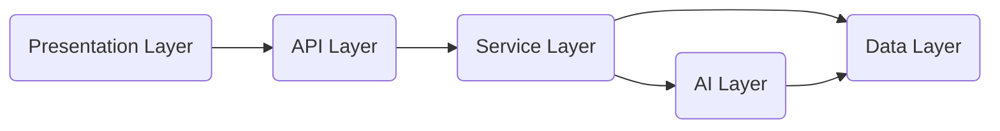
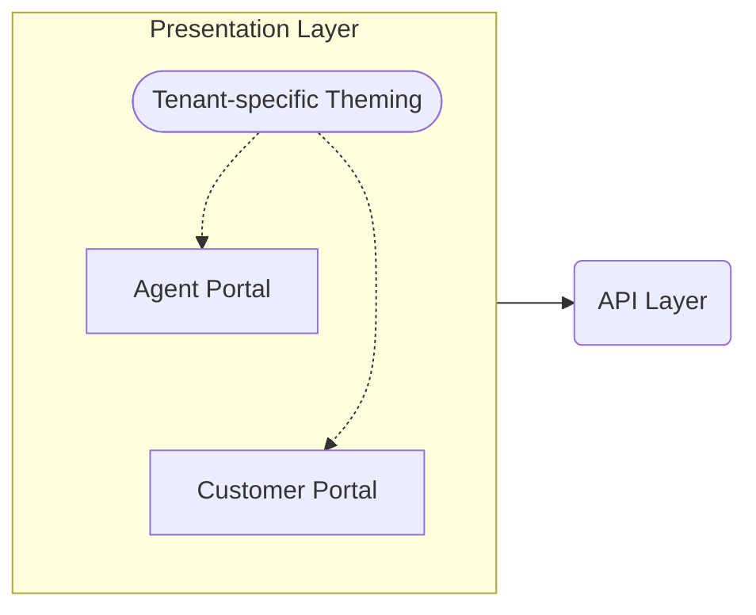
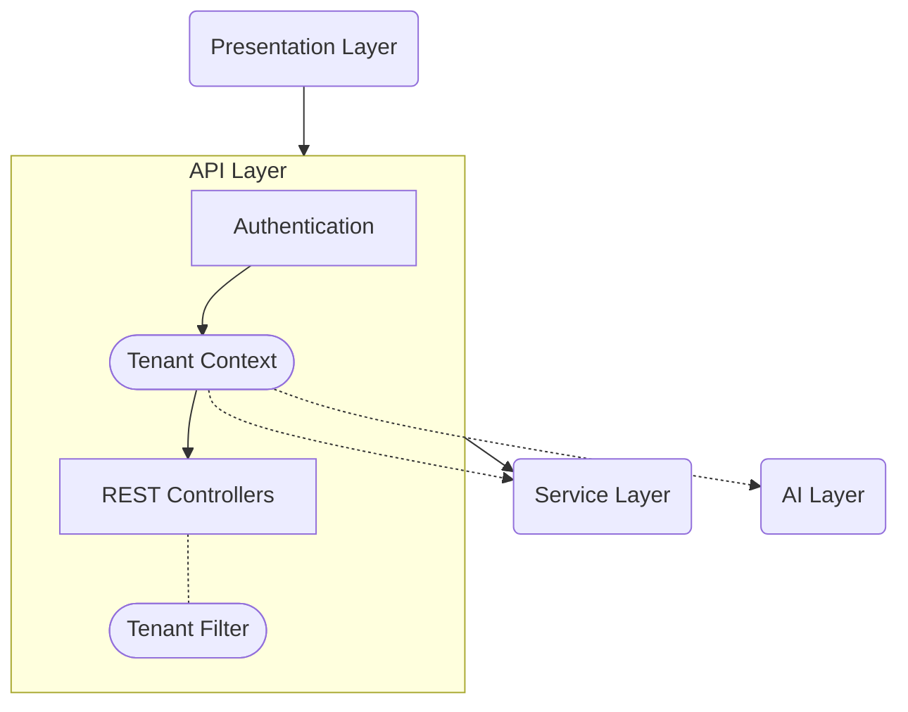
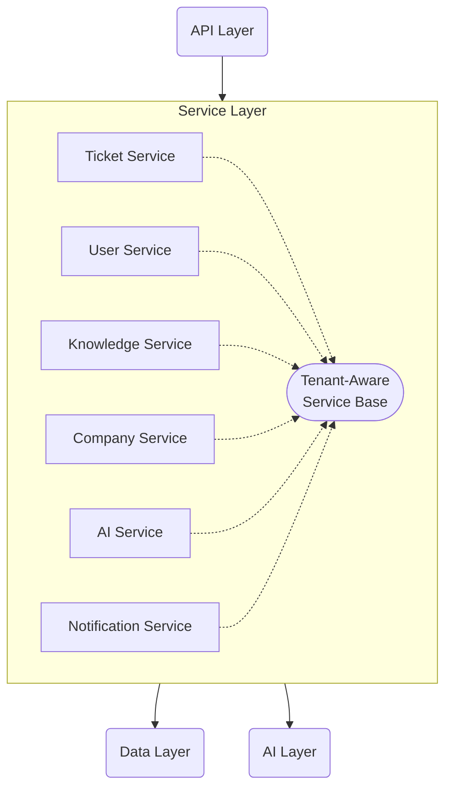
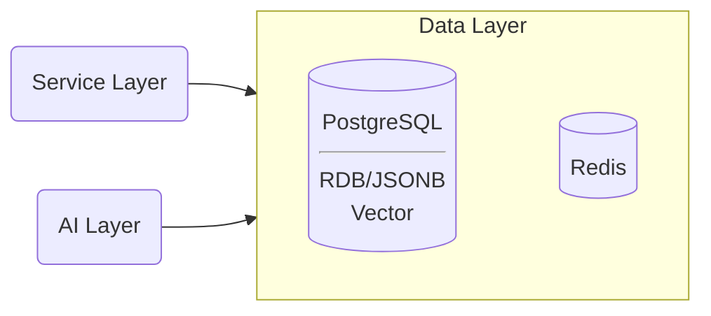
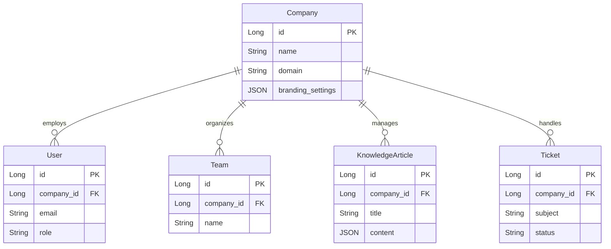

# Whisper Octopus: 100-Day MVP Challenge

## Executive Summary

Whisper Octopus is a multi-tenant, AI-enhanced customer support platform to be developed over a 100-day coding challenge. This refactored plan adopts a pragmatic MVP approach, focusing on core functionality while reducing technical complexity. The platform will serve multiple businesses (B2B) and their customers (B2C), with a streamlined technology stack centered around Spring Boot, PostgreSQL, and targeted AI enhancements. Each business tenant will have their own isolated environment within the shared platform, allowing for separate teams, knowledge bases, and customer portals. This approach balances ambition with achievability, ensuring a functional end-to-end system within the 100-day timeframe.

## Business Objectives

1. **Deliver Core Platform Functionality**
    - Create essential B2B agent tools for ticket management across multiple tenants
    - Build fundamental B2C customer self-service capabilities with tenant-specific branding
    - Establish a shared knowledge base system with proper tenant isolation

2. **Implement Multi-Tenant Architecture**
    - Design a secure tenant isolation model from the ground up
    - Create tenant onboarding and management capabilities
    - Support tenant-specific configurations and branding

3. **Demonstrate Practical AI Integration**
    - Implement smart ticket classification and routing within tenant boundaries
    - Create a simplified RAG system for tenant-specific knowledge retrieval
    - Develop basic agent assistance capabilities

4. **Create a Sustainable Foundation**
    - Build on a simplified but scalable multi-tenant architecture
    - Focus on quality and testing for core features
    - Establish patterns for future expansion

## MVP Scope Definition

### Multi-Tenant Foundation

- Tenant registration and onboarding workflow
- Company settings and configuration management
- Basic white-labeling and branding options
- Tenant-aware security model and data isolation
- Tenant administration dashboard

### B2B Agent Portal (Essential Features)

- Agent dashboard with tenant-specific ticket overview and metrics
- Comprehensive ticket management workflow within tenant boundaries
- Knowledge base article creation and management
- Team management and assignment within a company
- Simple SLA monitoring and alerts
- AI-assisted response suggestions

### B2C Customer Portal (Essential Features)

- Tenant-branded knowledge base browsing and search
- Streamlined ticket submission and tracking
- Community solutions (initially read-only) within tenant context
- Simple satisfaction surveys
- Email notifications for ticket updates

### AI Integration (Focused Approach)

- Tenant-specific ticket categorization and priority suggestion
- Agent routing based on content analysis within company teams
- Basic RAG implementation for tenant-isolated knowledge retrieval
- Response drafting assistance for agents
- Relevant article suggestions for tickets

## Streamlined Technical Architecture

### Core Technologies

- **Backend Framework**: Spring Boot 3.4+, Java 21
- **Primary Database**: PostgreSQL with pgvector extension
- **Caching**: Redis for performance optimization with tenant awareness
- **Security**: Spring Security with JWT authentication and tenant context
- **Frontend**: Thymeleaf for both portals with tenant-specific theming
- **Testing**: JUnit, TestContainers, Cucumber
- **Deployment**: Docker Compose for development and staging

### Multi-Tenant Data Strategy

1. **Shared Database with Tenant Discrimination**
    - Tenant identifier column in all tenant-specific tables
    - Database constraints to enforce tenant isolation
    - Service-layer filtering by tenant context
    - Tenant-aware repositories and queries

2. **PostgreSQL-Centric Approach**
    - Relational data for users, tickets, teams, and workflow
    - JSONB columns for document-like content (knowledge base)
    - pgvector extension for embedding storage and similarity search
    - Flyway for database migration management

3. **Redis Integration**
    - Tenant-aware session management and caching
    - Rate limiting for public APIs
    - Simple pub/sub for notifications

### AI Implementation Strategy

1. **Smart Classification**
    - Integration with embedding and classification services
    - Tenant-specific rule-based routing enhanced with AI suggestions
    - Configurable classification categories and workflows per tenant

2. **Knowledge Retrieval**
    - Tenant-isolated chunked document storage in PostgreSQL
    - Vector similarity search for relevant content within tenant boundaries
    - Relevance scoring and filtering

3. **Agent Assistance**
    - Context-aware response suggestions based on tenant knowledge
    - Historical ticket pattern recognition within tenant history
    - Tenant-specific knowledge base article recommendations

## 100-Day Implementation Timeline

### Phase 1: Multi-Tenant Foundation (Days 1-20)

- Project setup with Maven multi-module structure
- PostgreSQL integration with tenant-aware schema design
- Core entity models with tenant discrimination
- Tenant context framework and security implementation
- JWT authentication with tenant context propagation
- Essential REST API endpoints with tenant filtering
- Docker Compose development environment
- CI pipeline with GitHub Actions

**Deliverables:**
- Functional multi-tenant architecture
- Tenant isolation at database and service layers
- Basic API functionality with tenant-aware authentication
- Initial database schema with migrations
- Working CI pipeline for automated testing

### Phase 2: Company and B2B Essentials (Days 21-40)

- Company registration and management
- Tenant administration dashboard
- Agent dashboard with Thymeleaf and tenant-specific theming
- Ticket management workflows within tenant boundaries:
    - Creation, assignment, status updates
    - Internal comments and customer responses
    - Basic filtering and search
- Knowledge base foundations with tenant isolation:
    - Article creation with Markdown
    - Simple categorization and versioning
- Redis integration for tenant-aware caching
- Team management and user administration within tenant context

**Deliverables:**
- Company onboarding workflow
- Functional agent portal with tenant isolation
- Complete ticket lifecycle management
- Knowledge base content management per tenant
- User and team administration within company context

### Phase 3: B2C Experience (Days 41-60)

- Customer portal with Thymeleaf and tenant-specific branding
- Tenant-specific knowledge base browsing and search
- Ticket submission and tracking within tenant context
- Email notifications for updates with company branding
- Community solutions viewing within tenant boundaries
- Customer satisfaction collection
- Frontend styling and tenant-specific theming
- White-labeling capabilities for customer portal

**Deliverables:**
- Tenant-branded customer-facing support portal
- Complete customer support journey
- Email integration for notifications
- Tenant-specific UI theming system
- User-friendly interface design

### Phase 4: AI Enhancement (Days 61-80)

- pgvector setup and embedding pipeline
- Tenant-isolated knowledge base vectorization
- Ticket classification implementation with tenant context
- Basic RAG functionality for tenant-specific knowledge retrieval
- Agent assistance features within tenant boundaries:
    - Response suggestions
    - Article recommendations
    - Similar ticket identification
- Tenant-specific AI configuration controls

**Deliverables:**
- Working ticket classification system with tenant awareness
- Tenant-isolated knowledge retrieval for support contexts
- Agent assistance capabilities
- AI configuration interface per tenant

### Phase 5: Refinement (Days 81-100)

- Comprehensive testing (unit, integration, E2E) with tenant scenarios
- Multi-tenant performance optimization
- Security hardening with focus on tenant isolation
- Documentation:
    - API documentation
    - User guides for tenants
    - System architecture with multi-tenancy explanation
- Deployment pipeline for staging environment
- Final UI/UX polishing for tenant branding
- Tenant analytics dashboard

**Deliverables:**
- Production-ready multi-tenant application
- Comprehensive test suite including tenant isolation tests
- Complete documentation for tenants
- Deployment pipeline
- Presentation-quality UI with tenant branding

## Technical Architecture Diagram

### Presentation Layer

### API Layer

### Service Layer

### Data Layer

## Data Model Highlights

## Risk Management

| Risk | Impact | Mitigation |
|------|--------|------------|
| Multi-tenant complexity | High | Implement tenant isolation early; use consistent patterns throughout |
| Tenant data leakage | Critical | Comprehensive testing of tenant boundaries; security audit |
| AI integration complexity | High | Focus on specific, well-defined AI features with fallbacks |
| Learning curve for vector search | Medium | Start with simple similarity search, increase sophistication over time |
| Performance with multiple tenants | Medium | Implement caching early, monitor performance by tenant |
| Scope creep | High | Maintain strict prioritization, defer non-MVP features |
| Technical debt | Medium | Regular refactoring sessions, maintain test coverage |

## Success Metrics

### Technical Metrics
- Test coverage >75% for core components
- API response time <500ms for 95% of requests across tenants
- Successful tenant isolation in security tests
- Successful AI classifications >80% accuracy
- System uptime >99.5% during testing

### Business Metrics
- Support agent productivity improvement
- Customer self-service resolution rate by tenant
- Knowledge article utilization
- Ticket resolution time reduction
- Tenant onboarding completion rate

## Conclusion

This refactored plan focuses on delivering a complete, functional MVP of the Whisper Octopus platform within the 100-day timeline, with multi-tenancy as a core architectural feature. By implementing tenant isolation from the beginning, the platform becomes more commercially viable while still maintaining a streamlined technology stack and focused feature set.

The multi-tenant MVP approach creates a solid foundation that can be expanded upon after the challenge. Future enhancements could include the originally planned advanced AI capabilities, additional data stores for specialized use cases, more sophisticated tenant customization options, and advanced deployment infrastructure.