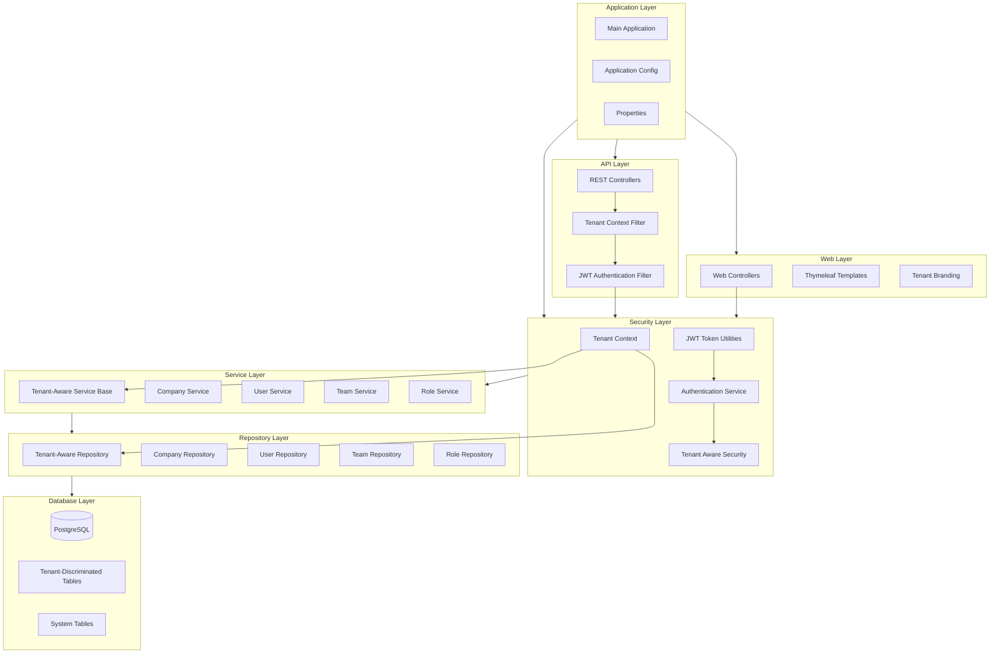

# Whisper Octopus: Phase 1 PRD - Multi-Tenant Foundation

## 1. Overview

### 1.1 Product Vision
Phase 1 of the Whisper Octopus project will establish the critical multi-tenant foundation that will support the entire platform. This phase focuses on implementing the core architecture, security model, and infrastructure necessary to build a scalable, secure, and isolated multi-tenant customer support platform.

### 1.2 Timeline
Days 1-20 of the 100-day MVP challenge

### 1.3 Phase Goals
- Establish a secure multi-tenant architecture from the ground up
- Implement tenant isolation at both database and service layers
- Create a tenant context propagation system throughout the application
- Set up the development and CI environment
- Deliver a functional tenant-aware authentication system

## 2. Technical Requirements

### 2.1 Project Infrastructure

#### 2.1.1 Project Structure
- Set up a Maven multi-module project structure to support separation of concerns:
    - `whisper-octopus-core`: Core domain models, repositories, and services
    - `whisper-octopus-api`: REST API endpoints and controllers
    - `whisper-octopus-web`: Thymeleaf templates and web controllers
    - `whisper-octopus-security`: Security configuration and tenant context
    - `whisper-octopus-app`: Application module that packages all other modules into the final deployable artifact

#### 2.1.2 Development Environment
- Implement Docker Compose configuration with:
    - PostgreSQL database container with pgvector extension
    - Redis container for caching and session management
    - Application container with hot-reload for development
    - Configurable environment variables for different deployment scenarios

#### 2.1.3 Continuous Integration
- Set up GitHub Actions workflow for:
    - Automated building and testing on pull requests
    - Code quality checks using SonarQube
    - Test coverage reporting
    - Docker image building

### 2.2 Database Implementation

#### 2.2.1 Multi-Tenant Schema Design
- Implement shared database strategy with tenant discrimination:
    - Add `company_id` column to all tenant-specific tables
    - Create database constraints to enforce tenant isolation
    - Set up appropriate indexes for tenant-filtered queries

#### 2.2.2 Core Entities
- Implement the following entity models with tenant discrimination:
    - `Company`: Core tenant entity with configuration
    - `User`: Company employees and system users
    - `Team`: Organizational structure within companies
    - `Role`: Permission sets within the system
    - `Permission`: Granular access controls

#### 2.2.3 Database Migration
- Implement Flyway for database migration management:
    - Initial schema creation
    - Seed data for system features
    - Test data for development

### 2.3 Security Implementation

#### 2.3.1 Tenant Context Framework
- Develop a `TenantContext` system that:
    - Stores the current tenant identifier in thread-local storage
    - Provides tenant information to services and repositories
    - Clears context after request processing
    - Supports tenant context propagation across asynchronous operations

#### 2.3.2 Authentication System
- Implement JWT-based authentication with:
    - Tenant-aware token generation and validation
    - Token refresh mechanism
    - Token blacklisting for logout functionality
    - Appropriate token expiration policies

#### 2.3.3 Authorization Framework
- Create a permission-based authorization system:
    - Role-based access control within tenant boundaries
    - Method-level security with tenant context validation
    - Pre-authorization checks for controllers and services

### 2.4 API Implementation

#### 2.4.1 Tenant-Aware REST Endpoints
- Develop base controller configurations that:
    - Extract tenant context from authentication token
    - Validate tenant access for each request
    - Apply consistent error handling for tenant isolation breaches

#### 2.4.2 Essential API Endpoints
- Implement the following tenant-aware endpoints:
    - Authentication API (login, refresh, logout)
    - User management within tenant
    - Company settings and configuration
    - Health and status endpoints

#### 2.4.3 API Documentation
- Set up Springdoc OpenAPI for API documentation:
    - Document tenant context requirements
    - Include authentication requirements
    - Add sample requests and responses

### 2.5 Service Layer Implementation

#### 2.5.1 Tenant-Aware Services
- Create a `TenantAwareService` base class that:
    - Validates tenant context for all operations
    - Applies tenant filtering to all repository queries
    - Enforces tenant isolation boundaries

#### 2.5.2 Core Services
- Implement the following tenant-aware services:
    - `CompanyService` for tenant management
    - `UserService` for user operations within tenant
    - `AuthenticationService` for tenant-aware authentication
    - `TeamService` for tenant organizational structure

## 3. Functional Requirements

### 3.1 Tenant Registration (Basic)

#### 3.1.1 Company Registration
- Create API endpoints and service methods for:
    - Company registration with validation
    - Initial administrator user creation
    - Default tenant configuration setup

#### 3.1.2 Tenant Activation
- Implement the tenant activation workflow:
    - Email verification process
    - Account activation endpoint
    - Initial login redirect

### 3.2 Authentication & Authorization

#### 3.2.1 Authentication Workflows
- Implement the following authentication flows:
    - Username/password authentication with tenant context
    - Token-based session management
    - Password reset functionality with tenant validation

#### 3.2.2 Role-Based Authorization
- Set up tenant-specific authorization with:
    - Default roles (Admin, Manager, Agent)
    - Permission assignments to roles
    - Role assignment to users within tenant

### 3.3 User Management (Basic)

#### 3.3.1 User Creation
- Implement tenant-aware user management:
    - User creation within tenant boundary
    - Email invitation system
    - Initial password setup

#### 3.3.2 User Authentication
- Create the following authentication features:
    - Tenant-specific login page
    - Failed login protection
    - Session management

## 4. Technical Specifications

### 4.1 Database Schema

```sql
-- Company (Tenant) Table
CREATE TABLE company (
    id BIGSERIAL PRIMARY KEY,
    name VARCHAR(100) NOT NULL,
    domain VARCHAR(100) NOT NULL UNIQUE,
    status VARCHAR(20) NOT NULL DEFAULT 'ACTIVE',
    created_at TIMESTAMP NOT NULL DEFAULT CURRENT_TIMESTAMP,
    updated_at TIMESTAMP NOT NULL DEFAULT CURRENT_TIMESTAMP
);

-- User Table
CREATE TABLE app_user (
    id BIGSERIAL PRIMARY KEY,
    company_id BIGINT NOT NULL REFERENCES company(id),
    email VARCHAR(100) NOT NULL,
    password_hash VARCHAR(255) NOT NULL,
    first_name VARCHAR(50),
    last_name VARCHAR(50),
    status VARCHAR(20) NOT NULL DEFAULT 'ACTIVE',
    created_at TIMESTAMP NOT NULL DEFAULT CURRENT_TIMESTAMP,
    updated_at TIMESTAMP NOT NULL DEFAULT CURRENT_TIMESTAMP,
    UNIQUE (company_id, email)
);

-- Team Table
CREATE TABLE team (
    id BIGSERIAL PRIMARY KEY,
    company_id BIGINT NOT NULL REFERENCES company(id),
    name VARCHAR(100) NOT NULL,
    description TEXT,
    created_at TIMESTAMP NOT NULL DEFAULT CURRENT_TIMESTAMP,
    updated_at TIMESTAMP NOT NULL DEFAULT CURRENT_TIMESTAMP,
    UNIQUE (company_id, name)
);

-- Role Table
CREATE TABLE role (
    id BIGSERIAL PRIMARY KEY,
    company_id BIGINT REFERENCES company(id), -- NULL for system roles
    name VARCHAR(50) NOT NULL,
    description TEXT,
    created_at TIMESTAMP NOT NULL DEFAULT CURRENT_TIMESTAMP,
    updated_at TIMESTAMP NOT NULL DEFAULT CURRENT_TIMESTAMP,
    UNIQUE (company_id, name)
);

-- Permission Table
CREATE TABLE permission (
    id BIGSERIAL PRIMARY KEY,
    name VARCHAR(100) NOT NULL UNIQUE,
    description TEXT,
    created_at TIMESTAMP NOT NULL DEFAULT CURRENT_TIMESTAMP
);

-- Role-Permission Mapping
CREATE TABLE role_permission (
    role_id BIGINT NOT NULL REFERENCES role(id),
    permission_id BIGINT NOT NULL REFERENCES permission(id),
    PRIMARY KEY (role_id, permission_id)
);

-- User-Role Mapping
CREATE TABLE user_role (
    user_id BIGINT NOT NULL REFERENCES app_user(id),
    role_id BIGINT NOT NULL REFERENCES role(id),
    PRIMARY KEY (user_id, role_id)
);

-- User-Team Mapping
CREATE TABLE user_team (
    user_id BIGINT NOT NULL REFERENCES app_user(id),
    team_id BIGINT NOT NULL REFERENCES team(id),
    PRIMARY KEY (user_id, team_id)
);

-- Token Blacklist for JWT Invalidation
CREATE TABLE token_blacklist (
    token_signature VARCHAR(255) NOT NULL,
    expiry_date TIMESTAMP NOT NULL,
    company_id BIGINT REFERENCES company(id),
    created_at TIMESTAMP NOT NULL DEFAULT CURRENT_TIMESTAMP,
    PRIMARY KEY (token_signature)
);
```

### 4.2 Key API Endpoints

#### Authentication API
```
POST /api/v1/auth/login
  Request: { "email": "string", "password": "string", "companyDomain": "string" }
  Response: { "token": "string", "refreshToken": "string", "user": {...} }

POST /api/v1/auth/refresh
  Request: { "refreshToken": "string" }
  Response: { "token": "string", "refreshToken": "string" }

POST /api/v1/auth/logout
  Request: { "token": "string" }
  Response: { "success": true }
```

#### Company API
```
POST /api/v1/companies
  Request: { "name": "string", "domain": "string", "adminEmail": "string", ... }
  Response: { "id": 1, "name": "string", "domain": "string", ... }

GET /api/v1/companies/{id}
  Response: { "id": 1, "name": "string", "domain": "string", ... }

PUT /api/v1/companies/{id}
  Request: { "name": "string", ... }
  Response: { "id": 1, "name": "string", ... }
```

#### User API
```
POST /api/v1/users
  Request: { "email": "string", "firstName": "string", "lastName": "string", ... }
  Response: { "id": 1, "email": "string", ... }

GET /api/v1/users
  Response: [{ "id": 1, "email": "string", ... }, ...]

GET /api/v1/users/{id}
  Response: { "id": 1, "email": "string", ... }

PUT /api/v1/users/{id}
  Request: { "firstName": "string", ... }
  Response: { "id": 1, "firstName": "string", ... }
```

### 4.3 Security Configuration

#### JWT Configuration
```java
@Configuration
public class JwtConfig {
    @Value("${jwt.secret}")
    private String secret;
    
    @Value("${jwt.expiration}")
    private long expiration;
    
    @Value("${jwt.refresh-expiration}")
    private long refreshExpiration;
    
    @Bean
    public JwtTokenUtil jwtTokenUtil() {
        return new JwtTokenUtil(secret, expiration, refreshExpiration);
    }
}
```

#### Tenant Context Configuration
```java
@Configuration
public class TenantContextConfiguration {
    @Bean
    public TenantContextFilter tenantContextFilter() {
        return new TenantContextFilter();
    }
    
    @Bean
    public TenantContext tenantContext() {
        return new TenantContext();
    }
}
```

## 5. Testing Requirements

### 5.1 Unit Testing
- Write unit tests for:
    - Tenant context functionality
    - Service layer tenant isolation
    - JWT authentication with tenant context
    - Repository queries with tenant filtering

### 5.2 Integration Testing
- Implement integration tests for:
    - Database schema and constraints
    - API endpoints with tenant isolation
    - Authentication workflows across tenants
    - Cross-tenant access attempts

### 5.3 Test Data
- Create test fixtures for:
    - Multiple test companies
    - Users within each company
    - Teams and roles per company
    - Cross-tenant test scenarios

## 6. Deliverables

By the end of Phase 1 (Day 20), the team will deliver:

1. **Functional Multi-Tenant Architecture**
    - Complete tenant isolation at database level
    - Tenant context propagation throughout the application
    - Tenant-aware service layer

2. **Authentication System**
    - JWT-based authentication with tenant awareness
    - Token management and refresh flows
    - Role-based authorization within tenant boundaries

3. **Core API Implementation**
    - Essential REST endpoints with tenant context
    - API documentation with tenant requirements
    - Error handling for tenant isolation breaches

4. **Development Environment**
    - Docker Compose setup for local development
    - Database initialization and migration scripts
    - CI pipeline for automated testing

5. **Initial Database Schema**
    - All core entities with tenant discrimination
    - Constraints to enforce tenant isolation
    - Indexes optimized for tenant-filtered queries

6. **Deployable Application Artifact**
    - Single executable JAR file containing all modules
    - Docker image ready for deployment
    - Configuration for different environments (development, testing, staging)

## 7. Future Considerations

### 7.1 Phase 1 Limitations
- Basic tenant onboarding only (full workflow in Phase 2)
- Limited user management functionality
- No customer-facing components
- Minimal tenant configuration options

### 7.2 Preparation for Phase 2
- Design considerations for ticket management
- Data model extensions for knowledge base
- Service interfaces for future components

### 7.3 Technical Debt Management
- Identify areas for refactoring in Phase 2
- Document known limitations
- Plan for comprehensive test coverage expansion

## 8. Technical Architecture Diagram



## 9. Risks and Mitigations

| Risk | Impact | Probability | Mitigation |
|------|--------|------------|------------|
| Tenant isolation breaches | Critical | Medium | Comprehensive testing of tenant boundaries; automated security tests; code reviews focusing on tenant context |
| JWT implementation flaws | High | Low | Follow security best practices; use established libraries; implement token validation and proper expiration |
| Database performance with tenant filtering | Medium | Medium | Index all tenant ID columns; optimize queries; implement query monitoring |
| Development environment complexity | Medium | Low | Thorough documentation; simplified Docker setup; automation scripts |
| Tenant context propagation failures | High | Medium | Unit tests for all propagation scenarios; centralized context handling; monitoring and logging |

## 10. Success Criteria

Phase 1 will be considered successful when:

1. All tenant-specific database operations are automatically filtered by tenant ID
2. Authentication system correctly enforces tenant boundaries
3. API endpoints properly validate tenant context
4. No data leakage between tenants is possible
5. Development environment enables efficient progress on subsequent phases
6. CI pipeline successfully builds and tests the application
7. All unit and integration tests pass, with >80% test coverage

## 11. Appendix

### 11.1 Maven Module Structure

```
whisper-octopus/                   # Parent module directory
│
├── pom.xml                        # Parent POM file
│
├── whisper-octopus-core/          # Core module
│   ├── pom.xml
│   └── src/
│
├── whisper-octopus-security/      # Security module  
│   ├── pom.xml
│   └── src/
│
├── whisper-octopus-api/           # API module
│   ├── pom.xml
│   └── src/
│
├── whisper-octopus-web/           # Web module
│   ├── pom.xml
│   └── src/
│
└── whisper-octopus-app/           # Application/packaging module
    ├── pom.xml                    # Includes Spring Boot plugin
    ├── src/
    │   ├── main/
    │   │   ├── java/
    │   │   │   └── com/whisperoctopus/
    │   │   │       └── WhisperOctopusApplication.java
    │   │   └── resources/
    │   │       ├── application.yml
    │   │       ├── db/migration/     # Flyway migration scripts
    │   │       └── banner.txt        # Spring Boot startup banner
    │   └── test/
    └── Dockerfile                 # For building the Docker image
```

### 11.2 Key Classes and Interfaces

#### Tenant Context
```java
public class TenantContext {
    private static ThreadLocal<Long> currentTenant = new ThreadLocal<>();
    
    public static void setTenantId(Long tenantId) {
        currentTenant.set(tenantId);
    }
    
    public static Long getTenantId() {
        return currentTenant.get();
    }
    
    public static void clear() {
        currentTenant.remove();
    }
}
```

#### Tenant-Aware Repository
```java
public interface TenantAwareRepository<T, ID> extends JpaRepository<T, ID> {
    @Override
    @Query("SELECT e FROM #{#entityName} e WHERE e.companyId = :#{@tenantContext.getTenantId()}")
    List<T> findAll();
    
    @Override
    @Query("SELECT e FROM #{#entityName} e WHERE e.id = :id AND e.companyId = :#{@tenantContext.getTenantId()}")
    Optional<T> findById(@Param("id") ID id);
    
    // Additional tenant-aware methods...
}
```

#### Tenant-Aware Service Base
```java
public abstract class TenantAwareService<T, ID> {
    private final TenantAwareRepository<T, ID> repository;
    
    public TenantAwareService(TenantAwareRepository<T, ID> repository) {
        this.repository = repository;
    }
    
    public List<T> findAll() {
        return repository.findAll();
    }
    
    public Optional<T> findById(ID id) {
        return repository.findById(id);
    }
    
    // Additional tenant-aware methods with tenant validation...
}
```

### 11.3 Application Module Configuration

#### Application Main Class
```java
package com.whisperoctopus;

import org.springframework.boot.SpringApplication;
import org.springframework.boot.autoconfigure.SpringBootApplication;
import org.springframework.boot.autoconfigure.domain.EntityScan;
import org.springframework.data.jpa.repository.config.EnableJpaRepositories;

@SpringBootApplication
@EntityScan(basePackages = "com.whisperoctopus.core.model")
@EnableJpaRepositories(basePackages = "com.whisperoctopus.core.repository")
public class WhisperOctopusApplication {
    
    public static void main(String[] args) {
        SpringApplication.run(WhisperOctopusApplication.class, args);
    }
}
```

#### Application Module POM
```xml
<?xml version="1.0" encoding="UTF-8"?>
<project xmlns="http://maven.apache.org/POM/4.0.0"
         xmlns:xsi="http://www.w3.org/2001/XMLSchema-instance"
         xsi:schemaLocation="http://maven.apache.org/POM/4.0.0 http://maven.apache.org/xsd/maven-4.0.0.xsd">
    <modelVersion>4.0.0</modelVersion>
    
    <parent>
        <groupId>com.whisperoctopus</groupId>
        <artifactId>whisper-octopus</artifactId>
        <version>0.1.0-SNAPSHOT</version>
    </parent>
    
    <artifactId>whisper-octopus-app</artifactId>
    <name>Whisper Octopus Application</name>
    <description>Main application module that packages all components</description>
    
    <dependencies>
        <!-- Project module dependencies -->
        <dependency>
            <groupId>com.whisperoctopus</groupId>
            <artifactId>whisper-octopus-core</artifactId>
            <version>${project.version}</version>
        </dependency>
        <dependency>
            <groupId>com.whisperoctopus</groupId>
            <artifactId>whisper-octopus-security</artifactId>
            <version>${project.version}</version>
        </dependency>
        <dependency>
            <groupId>com.whisperoctopus</groupId>
            <artifactId>whisper-octopus-api</artifactId>
            <version>${project.version}</version>
        </dependency>
        <dependency>
            <groupId>com.whisperoctopus</groupId>
            <artifactId>whisper-octopus-web</artifactId>
            <version>${project.version}</version>
        </dependency>
        
        <!-- Spring Boot Starter Web -->
        <dependency>
            <groupId>org.springframework.boot</groupId>
            <artifactId>spring-boot-starter-web</artifactId>
        </dependency>
        
        <!-- Additional runtime dependencies -->
        <dependency>
            <groupId>org.springframework.boot</groupId>
            <artifactId>spring-boot-starter-actuator</artifactId>
        </dependency>
    </dependencies>
    
    <build>
        <plugins>
            <plugin>
                <groupId>org.springframework.boot</groupId>
                <artifactId>spring-boot-maven-plugin</artifactId>
                <configuration>
                    <mainClass>com.whisperoctopus.WhisperOctopusApplication</mainClass>
                    <executable>true</executable>
                </configuration>
                <executions>
                    <execution>
                        <goals>
                            <goal>repackage</goal>
                        </goals>
                    </execution>
                </executions>
            </plugin>
        </plugins>
    </build>
</project>
```

### 11.4 Docker Compose Configuration
```yaml
version: '3.8'
services:
  postgres:
    image: postgres:16
    ports:
      - "5432:5432"
    environment:
      POSTGRES_USER: whisper
      POSTGRES_PASSWORD: octopus
      POSTGRES_DB: whisper_octopus
    volumes:
      - postgres-data:/var/lib/postgresql/data
      - ./sql/init-extensions.sql:/docker-entrypoint-initdb.d/init-extensions.sql
  
  redis:
    image: redis:7
    ports:
      - "6379:6379"
    volumes:
      - redis-data:/data
  
  app:
    build: 
      context: .
      dockerfile: Dockerfile.dev
    ports:
      - "8080:8080"
    environment:
      SPRING_DATASOURCE_URL: jdbc:postgresql://postgres:5432/whisper_octopus
      SPRING_DATASOURCE_USERNAME: whisper
      SPRING_DATASOURCE_PASSWORD: octopus
      SPRING_REDIS_HOST: redis
      SPRING_REDIS_PORT: 6379
      JWT_SECRET: developmentSecretKeyThatShouldBeChangedInProduction
      JWT_EXPIRATION: 3600000
      JWT_REFRESH_EXPIRATION: 86400000
    depends_on:
      - postgres
      - redis
    volumes:
      - ./:/app
      - maven-repo:/root/.m2

volumes:
  postgres-data:
  redis-data:
  maven-repo:
```

### 11.5 GitHub Actions Workflow
```yaml
name: Build and Test

on:
  push:
    branches: [ main, develop ]
  pull_request:
    branches: [ main, develop ]

jobs:
  build:
    runs-on: ubuntu-latest
    steps:
    - uses: actions/checkout@v3
    
    - name: Set up JDK 21
      uses: actions/setup-java@v3
      with:
        java-version: '21'
        distribution: 'temurin'
        cache: maven
    
    - name: Build with Maven
      run: mvn -B package -DskipTests
    
    - name: Run Tests
      run: mvn -B test
    
    - name: Generate Test Report
      run: mvn jacoco:report
    
    - name: SonarQube Scan
      env:
        GITHUB_TOKEN: ${{ secrets.GITHUB_TOKEN }}
        SONAR_TOKEN: ${{ secrets.SONAR_TOKEN }}
      run: mvn -B sonar:sonar
    
    - name: Build Docker Images
      run: docker-compose build
```