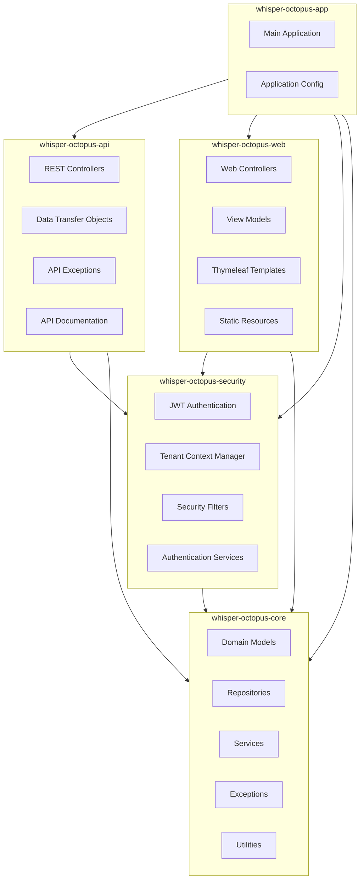
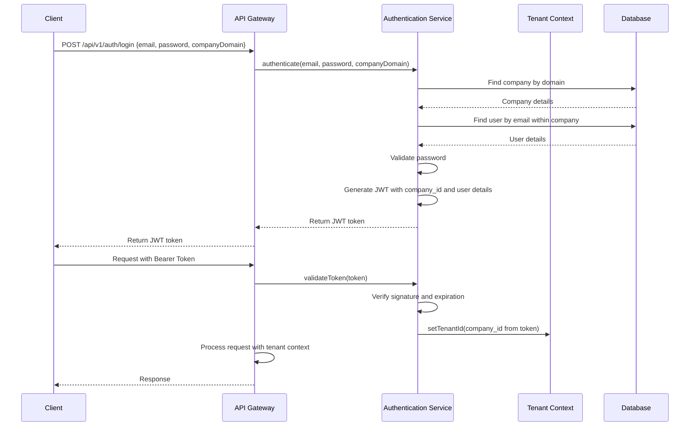
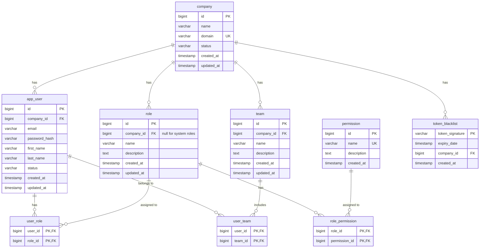
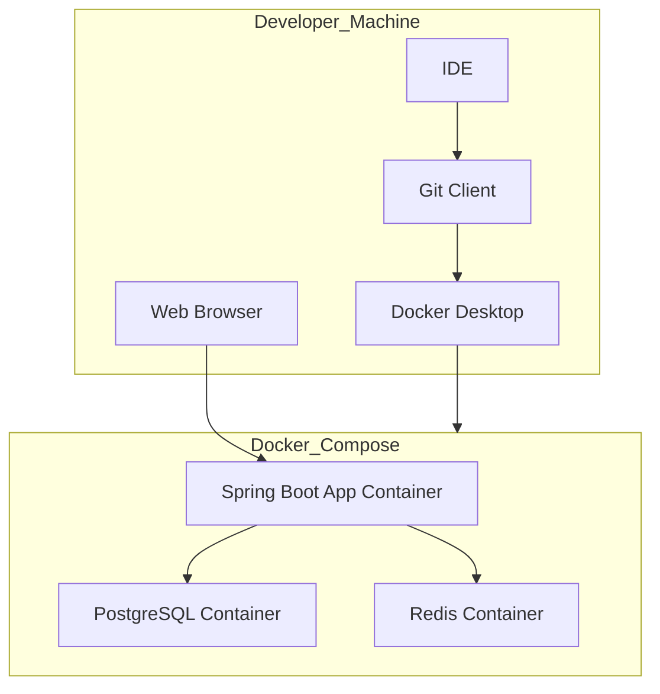
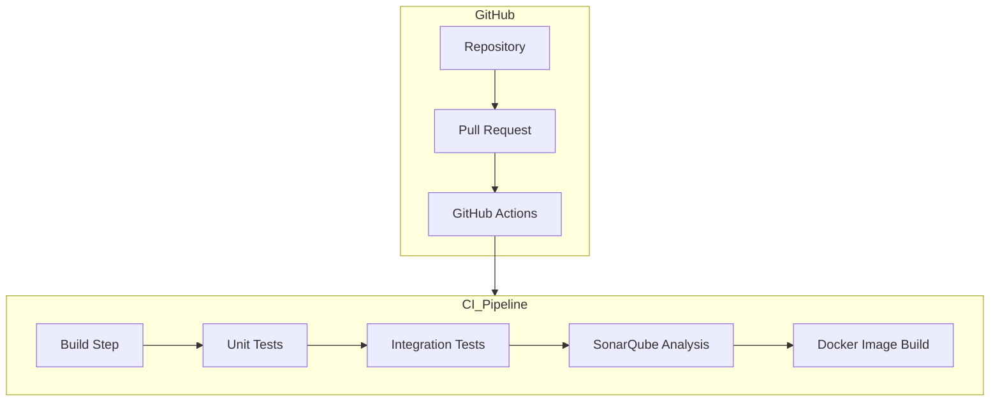

# Whisper Octopus: Phase 1 Software Architecture and Design

## 1. Introduction

### 1.1 Purpose
This Software Architecture and Design (SA/SD) document describes the technical architecture, component design, and implementation patterns for Phase 1 of the Whisper Octopus platform. It serves as a blueprint for developers implementing the multi-tenant foundation of the customer support platform.

### 1.2 Scope
This document covers the architecture and design details for implementing the core multi-tenant foundation, including:
- Multi-tenant database design
- Security and tenant isolation mechanisms
- Service layer implementation
- API design
- Authentication and authorization systems
- Project structure and module organization

### 1.3 Intended Audience
- Software developers implementing the system
- Technical leads and architects reviewing the design
- DevOps engineers setting up the deployment infrastructure
- QA engineers designing test strategies

### 1.4 Referenced Documents
- Whisper Octopus: 100-Day MVP Challenge Plan
- Whisper Octopus: Phase 1 PRD - Multi-Tenant Foundation

## 2. Architectural Overview

### 2.1 Architectural Style

The Whisper Octopus platform follows a layered architecture with clear separation of concerns:

1. **Presentation Layer**
    - REST API controllers (API module)
    - Web controllers and templates (Web module)

2. **Security Layer**
    - Authentication and authorization
    - Tenant context management

3. **Service Layer**
    - Business logic
    - Transaction management
    - Tenant-aware operations

4. **Repository Layer**
    - Data access
    - Query execution
    - Tenant filtering

5. **Data Layer**
    - Shared database with tenant discrimination
    - Data models with tenant isolation

### 2.2 Design Principles

The architecture is guided by the following principles:

1. **Tenant Isolation First**: All components must enforce tenant boundaries as a fundamental design consideration.
2. **Modularity**: Clear separation between modules with well-defined interfaces.
3. **Reusability**: Common patterns encapsulated into base classes for consistent implementation.
4. **Defense in Depth**: Security enforced at multiple layers to prevent tenant isolation breaches.
5. **Testability**: Design that facilitates comprehensive testing of tenant boundaries.
6. **Scalability**: Foundation for handling multiple tenants with varying workloads.

### 2.3 High-Level Component Diagram



## 3. Multi-Tenant Design

### 3.1 Tenancy Model

The Whisper Octopus platform implements a **shared schema multi-tenancy** approach:

1. **Tenant Identifier**
    - Each tenant is identified by a unique `company_id`
    - This identifier is stored in all tenant-specific database tables
    - It is propagated through all layers of the application

2. **Data Isolation**
    - All database queries automatically filter by tenant ID
    - Database constraints prevent cross-tenant access
    - Service layer validates tenant context for all operations

3. **Tenant Context**
    - Active tenant context stored in thread-local storage
    - Context established during authentication
    - Propagated through all service calls

### 3.2 Tenant Discrimination Implementation

#### 3.2.1 Entity Structure
```java
@MappedSuperclass
public abstract class TenantAwareEntity {
    @Id
    @GeneratedValue(strategy = GenerationType.IDENTITY)
    private Long id;
    
    @Column(name = "company_id", nullable = false)
    private Long companyId;
    
    // Common audit fields
    @Column(name = "created_at", nullable = false, updatable = false)
    private Instant createdAt;
    
    @Column(name = "updated_at", nullable = false)
    private Instant updatedAt;
    
    @PrePersist
    protected void onCreate() {
        createdAt = Instant.now();
        updatedAt = Instant.now();
        
        // Set tenant ID from context if not set
        if (companyId == null) {
            companyId = TenantContext.getTenantId();
        }
    }
    
    @PreUpdate
    protected void onUpdate() {
        updatedAt = Instant.now();
    }
    
    // Getters and setters
}
```

#### 3.2.2 Repository Layer
```java
public interface TenantAwareRepository<T extends TenantAwareEntity, ID> extends JpaRepository<T, ID> {
    @Override
    @Query("SELECT e FROM #{#entityName} e WHERE e.companyId = :#{@tenantContext.getTenantId()}")
    List<T> findAll();
    
    @Override
    @Query("SELECT e FROM #{#entityName} e WHERE e.id = :id AND e.companyId = :#{@tenantContext.getTenantId()}")
    Optional<T> findById(@Param("id") ID id);
    
    // Additional tenant-aware methods
    @Modifying
    @Query("DELETE FROM #{#entityName} e WHERE e.id = :id AND e.companyId = :#{@tenantContext.getTenantId()}")
    void deleteById(@Param("id") ID id);
    
    @Override
    default void delete(T entity) {
        if (!entity.getCompanyId().equals(TenantContext.getTenantId())) {
            throw new TenantIsolationException("Cannot delete entity from another tenant");
        }
        deleteById(entity.getId());
    }
    
    @Override
    default <S extends T> S save(S entity) {
        if (entity.getId() != null && entity.getCompanyId() != null &&
            !entity.getCompanyId().equals(TenantContext.getTenantId())) {
            throw new TenantIsolationException("Cannot update entity from another tenant");
        }
        entity.setCompanyId(TenantContext.getTenantId());
        return JpaRepository.super.save(entity);
    }
}
```

### 3.3 Tenant Context Management

```java
public class TenantContext {
    private static final ThreadLocal<Long> CURRENT_TENANT = new ThreadLocal<>();
    
    public static void setTenantId(Long tenantId) {
        CURRENT_TENANT.set(tenantId);
    }
    
    public static Long getTenantId() {
        Long tenantId = CURRENT_TENANT.get();
        if (tenantId == null) {
            throw new MissingTenantException("No tenant ID found in current context");
        }
        return tenantId;
    }
    
    public static boolean hasTenant() {
        return CURRENT_TENANT.get() != null;
    }
    
    public static void clear() {
        CURRENT_TENANT.remove();
    }
}
```

### 3.4 Tenant Context Filter

```java
@Component
@Order(Ordered.HIGHEST_PRECEDENCE + 10)
public class TenantContextFilter extends OncePerRequestFilter {
    
    @Override
    protected void doFilterInternal(HttpServletRequest request, 
                                    HttpServletResponse response, 
                                    FilterChain filterChain) throws ServletException, IOException {
        try {
            // Extract tenant ID from JWT token or other source
            String token = extractToken(request);
            if (token != null) {
                Long tenantId = jwtTokenUtil.getTenantIdFromToken(token);
                if (tenantId != null) {
                    TenantContext.setTenantId(tenantId);
                }
            }
            
            filterChain.doFilter(request, response);
        } finally {
            // Always clear the tenant context after request processing
            TenantContext.clear();
        }
    }
    
    private String extractToken(HttpServletRequest request) {
        String bearerToken = request.getHeader("Authorization");
        if (StringUtils.hasText(bearerToken) && bearerToken.startsWith("Bearer ")) {
            return bearerToken.substring(7);
        }
        return null;
    }
}
```

## 4. Security Architecture

### 4.1 Authentication Flow



### 4.2 JWT Structure

```java
public class JwtTokenUtil {
    
    private final String secret;
    private final long expiration;
    private final long refreshExpiration;
    
    public String generateToken(UserDetails userDetails, Long tenantId) {
        Map<String, Object> claims = new HashMap<>();
        claims.put("sub", userDetails.getUsername());
        claims.put("tenant_id", tenantId);
        claims.put("roles", userDetails.getAuthorities().stream()
                .map(GrantedAuthority::getAuthority)
                .collect(Collectors.toList()));
        
        return Jwts.builder()
                .setClaims(claims)
                .setIssuedAt(new Date())
                .setExpiration(new Date(System.currentTimeMillis() + expiration))
                .signWith(SignatureAlgorithm.HS512, secret)
                .compact();
    }
    
    public Long getTenantIdFromToken(String token) {
        Claims claims = getAllClaimsFromToken(token);
        return claims.get("tenant_id", Long.class);
    }
    
    // Other JWT utility methods
}
```

### 4.3 Authorization Implementation

```java
@Configuration
@EnableMethodSecurity
public class SecurityConfig {
    
    @Bean
    public SecurityFilterChain securityFilterChain(HttpSecurity http) throws Exception {
        return http
                .csrf(csrf -> csrf.disable())
                .authorizeHttpRequests(auth -> auth
                        .requestMatchers("/api/v1/auth/**").permitAll()
                        .requestMatchers("/api/v1/companies").permitAll()
                        .anyRequest().authenticated()
                )
                .sessionManagement(session -> session
                        .sessionCreationPolicy(SessionCreationPolicy.STATELESS)
                )
                .addFilterBefore(jwtAuthenticationFilter, UsernamePasswordAuthenticationFilter.class)
                .addFilterAfter(tenantContextFilter, JwtAuthenticationFilter.class)
                .build();
    }
    
    // Other security beans
}
```

### 4.4 Role-Based Authorization

```java
@Service
public class UserServiceImpl implements UserService {
    
    @PreAuthorize("hasRole('ADMIN')")
    @Override
    public User createUser(User user) {
        // Only administrators can create users
        // Tenant context is automatically applied by the repository
        return userRepository.save(user);
    }
    
    @PreAuthorize("hasAnyRole('ADMIN', 'MANAGER') or #id == authentication.principal.id")
    @Override
    public User updateUser(Long id, User userDetails) {
        // Admins and managers can update any user
        // Regular users can only update themselves
        User user = userRepository.findById(id)
                .orElseThrow(() -> new ResourceNotFoundException("User not found"));
        
        // Update user details
        return userRepository.save(user);
    }
    
    // Other user management methods
}
```

## 5. Module Design

### 5.1 Core Module

#### 5.1.1 Domain Models

```java
// Company Entity (Tenant)
@Entity
@Table(name = "company")
public class Company {
    @Id
    @GeneratedValue(strategy = GenerationType.IDENTITY)
    private Long id;
    
    @Column(nullable = false)
    private String name;
    
    @Column(nullable = false, unique = true)
    private String domain;
    
    @Column(nullable = false)
    @Enumerated(EnumType.STRING)
    private CompanyStatus status = CompanyStatus.ACTIVE;
    
    // Other fields, getters, setters
}

// User Entity
@Entity
@Table(name = "app_user")
public class User extends TenantAwareEntity {
    
    @Column(nullable = false)
    private String email;
    
    @Column(name = "password_hash", nullable = false)
    private String passwordHash;
    
    @Column(name = "first_name")
    private String firstName;
    
    @Column(name = "last_name")
    private String lastName;
    
    @Column(nullable = false)
    @Enumerated(EnumType.STRING)
    private UserStatus status = UserStatus.ACTIVE;
    
    // Other fields, getters, setters
}

// Team Entity
@Entity
@Table(name = "team")
public class Team extends TenantAwareEntity {
    
    @Column(nullable = false)
    private String name;
    
    @Column
    private String description;
    
    // Other fields, getters, setters
}

// Role Entity
@Entity
@Table(name = "role")
public class Role {
    @Id
    @GeneratedValue(strategy = GenerationType.IDENTITY)
    private Long id;
    
    @Column(nullable = false)
    private String name;
    
    @Column
    private String description;
    
    // Can be null for system-wide roles
    @Column(name = "company_id")
    private Long companyId;
    
    // Other fields, getters, setters
}
```

#### 5.1.2 Repositories

```java
public interface CompanyRepository extends JpaRepository<Company, Long> {
    Optional<Company> findByDomain(String domain);
}

public interface UserRepository extends TenantAwareRepository<User, Long> {
    Optional<User> findByEmailAndCompanyId(String email, Long companyId);
}

public interface TeamRepository extends TenantAwareRepository<Team, Long> {
    Optional<Team> findByNameAndCompanyId(String name, Long companyId);
}

public interface RoleRepository extends JpaRepository<Role, Long> {
    List<Role> findByCompanyIdIsNullOrCompanyId(Long companyId);
    
    Optional<Role> findByNameAndCompanyId(String name, Long companyId);
}
```

#### 5.1.3 Services

```java
@Service
public class CompanyServiceImpl implements CompanyService {
    
    private final CompanyRepository companyRepository;
    private final UserRepository userRepository;
    private final PasswordEncoder passwordEncoder;
    private final RoleRepository roleRepository;
    
    public CompanyServiceImpl(CompanyRepository companyRepository, 
                             UserRepository userRepository,
                             PasswordEncoder passwordEncoder,
                             RoleRepository roleRepository) {
        this.companyRepository = companyRepository;
        this.userRepository = userRepository;
        this.passwordEncoder = passwordEncoder;
        this.roleRepository = roleRepository;
    }
    
    @Override
    @Transactional
    public Company registerCompany(CompanyRegistrationRequest request) {
        // Validate company domain uniqueness
        if (companyRepository.findByDomain(request.getDomain()).isPresent()) {
            throw new DomainAlreadyExistsException("Company domain already exists");
        }
        
        // Create company
        Company company = new Company();
        company.setName(request.getName());
        company.setDomain(request.getDomain());
        company.setStatus(CompanyStatus.PENDING_ACTIVATION);
        
        company = companyRepository.save(company);
        
        // Create admin user
        try {
            // Set tenant context for user creation
            TenantContext.setTenantId(company.getId());
            
            User adminUser = new User();
            adminUser.setEmail(request.getAdminEmail());
            adminUser.setPasswordHash(passwordEncoder.encode(request.getAdminPassword()));
            adminUser.setFirstName(request.getAdminFirstName());
            adminUser.setLastName(request.getAdminLastName());
            
            userRepository.save(adminUser);
            
            // Assign admin role
            Role adminRole = roleRepository.findByNameAndCompanyId("ADMIN", company.getId())
                    .orElseGet(() -> {
                        Role newRole = new Role();
                        newRole.setName("ADMIN");
                        newRole.setCompanyId(company.getId());
                        return roleRepository.save(newRole);
                    });
            
            // Assign role to user (implementation omitted for brevity)
            
        } finally {
            // Always clear tenant context
            TenantContext.clear();
        }
        
        return company;
    }
    
    // Other company management methods
}
```

### 5.2 Security Module

#### 5.2.1 Custom Authentication Provider

```java
@Component
public class TenantAwareAuthenticationProvider implements AuthenticationProvider {
    
    private final UserRepository userRepository;
    private final CompanyRepository companyRepository;
    private final PasswordEncoder passwordEncoder;
    
    public TenantAwareAuthenticationProvider(UserRepository userRepository,
                                            CompanyRepository companyRepository,
                                            PasswordEncoder passwordEncoder) {
        this.userRepository = userRepository;
        this.companyRepository = companyRepository;
        this.passwordEncoder = passwordEncoder;
    }
    
    @Override
    public Authentication authenticate(Authentication authentication) throws AuthenticationException {
        TenantAwareAuthenticationToken auth = (TenantAwareAuthenticationToken) authentication;
        String email = auth.getName();
        String password = auth.getCredentials().toString();
        String companyDomain = auth.getCompanyDomain();
        
        // Find company by domain
        Company company = companyRepository.findByDomain(companyDomain)
                .orElseThrow(() -> new BadCredentialsException("Invalid company domain"));
        
        // Check company status
        if (company.getStatus() != CompanyStatus.ACTIVE) {
            throw new DisabledException("Company account is not active");
        }
        
        try {
            // Set tenant context for user lookup
            TenantContext.setTenantId(company.getId());
            
            // Find user by email within company
            User user = userRepository.findByEmailAndCompanyId(email, company.getId())
                    .orElseThrow(() -> new BadCredentialsException("Invalid email or password"));
            
            // Check user status
            if (user.getStatus() != UserStatus.ACTIVE) {
                throw new DisabledException("User account is disabled");
            }
            
            // Verify password
            if (!passwordEncoder.matches(password, user.getPasswordHash())) {
                throw new BadCredentialsException("Invalid email or password");
            }
            
            // Create authenticated token with authorities
            List<GrantedAuthority> authorities = getUserAuthorities(user);
            
            return new TenantAwareAuthenticationToken(
                    user.getEmail(),
                    null, // Clear password from authenticated token
                    company.getDomain(),
                    company.getId(),
                    authorities
            );
            
        } finally {
            TenantContext.clear();
        }
    }
    
    @Override
    public boolean supports(Class<?> authentication) {
        return TenantAwareAuthenticationToken.class.isAssignableFrom(authentication);
    }
    
    private List<GrantedAuthority> getUserAuthorities(User user) {
        // Implementation to retrieve user roles and permissions
        // Omitted for brevity
        return new ArrayList<>();
    }
}
```

#### 5.2.2 JWT Authentication Filter

```java
@Component
public class JwtAuthenticationFilter extends OncePerRequestFilter {
    
    private final JwtTokenUtil jwtTokenUtil;
    private final UserDetailsService userDetailsService;
    
    public JwtAuthenticationFilter(JwtTokenUtil jwtTokenUtil, UserDetailsService userDetailsService) {
        this.jwtTokenUtil = jwtTokenUtil;
        this.userDetailsService = userDetailsService;
    }
    
    @Override
    protected void doFilterInternal(HttpServletRequest request, 
                                   HttpServletResponse response, 
                                   FilterChain filterChain) throws ServletException, IOException {
        
        String token = extractToken(request);
        
        if (token != null && !isTokenBlacklisted(token)) {
            try {
                // Validate token
                if (jwtTokenUtil.validateToken(token)) {
                    String username = jwtTokenUtil.getUsernameFromToken(token);
                    Long tenantId = jwtTokenUtil.getTenantIdFromToken(token);
                    
                    // Set tenant context for user details lookup
                    TenantContext.setTenantId(tenantId);
                    
                    UserDetails userDetails = userDetailsService.loadUserByUsername(username);
                    
                    // Create authentication token
                    UsernamePasswordAuthenticationToken authentication = 
                            new UsernamePasswordAuthenticationToken(
                                    userDetails, null, userDetails.getAuthorities());
                    
                    // Set authentication in context
                    SecurityContextHolder.getContext().setAuthentication(authentication);
                }
            } catch (Exception e) {
                // Clear security context on error
                SecurityContextHolder.clearContext();
            }
        }
        
        filterChain.doFilter(request, response);
    }
    
    private String extractToken(HttpServletRequest request) {
        String bearerToken = request.getHeader("Authorization");
        if (StringUtils.hasText(bearerToken) && bearerToken.startsWith("Bearer ")) {
            return bearerToken.substring(7);
        }
        return null;
    }
    
    private boolean isTokenBlacklisted(String token) {
        // Check if token is blacklisted in repository
        // Implementation omitted for brevity
        return false;
    }
}
```

### 5.3 API Module

#### 5.3.1 Authentication Controller

```java
@RestController
@RequestMapping("/api/v1/auth")
public class AuthenticationController {
    
    private final AuthenticationManager authenticationManager;
    private final JwtTokenUtil jwtTokenUtil;
    private final TokenBlacklistService tokenBlacklistService;
    
    @PostMapping("/login")
    public ResponseEntity<?> login(@RequestBody LoginRequest loginRequest) {
        // Create authentication token with tenant information
        TenantAwareAuthenticationToken authenticationToken = 
                new TenantAwareAuthenticationToken(
                        loginRequest.getEmail(),
                        loginRequest.getPassword(),
                        loginRequest.getCompanyDomain()
                );
        
        // Authenticate
        Authentication authentication = authenticationManager.authenticate(authenticationToken);
        
        // Get tenant ID from authenticated token
        TenantAwareAuthenticationToken tenantToken = (TenantAwareAuthenticationToken) authentication;
        Long tenantId = tenantToken.getTenantId();
        
        // Generate JWT token
        UserDetails userDetails = (UserDetails) authentication.getPrincipal();
        String token = jwtTokenUtil.generateToken(userDetails, tenantId);
        String refreshToken = jwtTokenUtil.generateRefreshToken(userDetails, tenantId);
        
        // Return response
        return ResponseEntity.ok(new JwtResponse(token, refreshToken, userDetails));
    }
    
    @PostMapping("/refresh")
    public ResponseEntity<?> refreshToken(@RequestBody RefreshTokenRequest request) {
        String refreshToken = request.getRefreshToken();
        
        // Validate refresh token
        if (!jwtTokenUtil.validateToken(refreshToken)) {
            return ResponseEntity.status(HttpStatus.UNAUTHORIZED)
                    .body(new ErrorResponse("Invalid refresh token"));
        }
        
        // Get user details and tenant ID from token
        String username = jwtTokenUtil.getUsernameFromToken(refreshToken);
        Long tenantId = jwtTokenUtil.getTenantIdFromToken(refreshToken);
        
        // Generate new access token
        TenantContext.setTenantId(tenantId);
        try {
            UserDetails userDetails = userDetailsService.loadUserByUsername(username);
            String newToken = jwtTokenUtil.generateToken(userDetails, tenantId);
            
            return ResponseEntity.ok(new JwtResponse(newToken, refreshToken, userDetails));
        } finally {
            TenantContext.clear();
        }
    }
    
    @PostMapping("/logout")
    public ResponseEntity<?> logout(@RequestBody LogoutRequest request) {
        // Add token to blacklist
        tokenBlacklistService.blacklistToken(request.getToken());
        
        return ResponseEntity.ok(new MessageResponse("Logout successful"));
    }
}
```

#### 5.3.2 Company Controller

```java
@RestController
@RequestMapping("/api/v1/companies")
public class CompanyController {
    
    private final CompanyService companyService;
    
    public CompanyController(CompanyService companyService) {
        this.companyService = companyService;
    }
    
    @PostMapping
    public ResponseEntity<CompanyDTO> registerCompany(@Valid @RequestBody CompanyRegistrationRequest request) {
        Company company = companyService.registerCompany(request);
        return ResponseEntity.status(HttpStatus.CREATED)
                .body(mapToDTO(company));
    }
    
    @GetMapping("/{id}")
    public ResponseEntity<CompanyDTO> getCompany(@PathVariable Long id) {
        Company company = companyService.getCompanyById(id);
        return ResponseEntity.ok(mapToDTO(company));
    }
    
    @PutMapping("/{id}")
    public ResponseEntity<CompanyDTO> updateCompany(
            @PathVariable Long id,
            @Valid @RequestBody CompanyUpdateRequest request) {
        Company company = companyService.updateCompany(id, request);
        return ResponseEntity.ok(mapToDTO(company));
    }
    
    private CompanyDTO mapToDTO(Company company) {
        // Mapping implementation omitted for brevity
        return new CompanyDTO();
    }
}
```

#### 5.3.3 User Controller

```java
@RestController
@RequestMapping("/api/v1/users")
public class UserController {
    
    private final UserService userService;
    
    public UserController(UserService userService) {
        this.userService = userService;
    }
    
    @GetMapping
    public ResponseEntity<List<UserDTO>> getAllUsers() {
        List<User> users = userService.getAllUsers();
        List<UserDTO> userDTOs = users.stream()
                .map(this::mapToDTO)
                .collect(Collectors.toList());
        
        return ResponseEntity.ok(userDTOs);
    }
    
    @GetMapping("/{id}")
    public ResponseEntity<UserDTO> getUser(@PathVariable Long id) {
        User user = userService.getUserById(id);
        return ResponseEntity.ok(mapToDTO(user));
    }
    
    @PostMapping
    public ResponseEntity<UserDTO> createUser(@Valid @RequestBody UserCreateRequest request) {
        User user = userService.createUser(request);
        return ResponseEntity.status(HttpStatus.CREATED)
                .body(mapToDTO(user));
    }
    
    @PutMapping("/{id}")
    public ResponseEntity<UserDTO> updateUser(
            @PathVariable Long id,
            @Valid @RequestBody UserUpdateRequest request) {
        User user = userService.updateUser(id, request);
        return ResponseEntity.ok(mapToDTO(user));
    }
    
    private UserDTO mapToDTO(User user) {
        // Mapping implementation omitted for brevity
        return new UserDTO();
    }
}
```

### 5.4 Web Module

#### 5.4.1 Web Controllers

```java
@Controller
@RequestMapping("/login")
public class LoginController {
    
    @GetMapping
    public String loginPage(@RequestParam(required = false) String domain, Model model) {
        model.addAttribute("domain", domain);
        return "login";
    }
    
    @PostMapping
    public String processLogin(@RequestParam String email, 
                              @RequestParam String password,
                              @RequestParam String domain,
                              HttpServletResponse response) {
        // Implementation omitted
        // This would make a call to the authentication service
        // and set cookies for the web session
        
        return "redirect:/dashboard";
    }
}

@Controller
@RequestMapping("/dashboard")
public class DashboardController {
    
    private final UserService userService;
    
    @GetMapping
    public String dashboard(Model model) {
        // Get current user
        Authentication auth = SecurityContextHolder.getContext().getAuthentication();
        User currentUser = userService.getUserByEmail(auth.getName());
        
        model.addAttribute("user", currentUser);
        
        return "dashboard";
    }
}
```

#### 5.4.2 Thymeleaf Templates

```html
<!-- login.html -->
<!DOCTYPE html>
<html xmlns:th="http://www.thymeleaf.org">
<head>
    <title>Login - Whisper Octopus</title>
    <meta charset="UTF-8"/>
    <meta name="viewport" content="width=device-width, initial-scale=1.0"/>
    <link rel="stylesheet" th:href="@{/css/main.css}"/>
</head>
<body>
    <div class="login-container">
        <div class="login-form">
            <h1>Sign In</h1>
            
            <form th:action="@{/login}" method="post">
                <div class="form-group">
                    <label for="domain">Company Domain</label>
                    <input type="text" id="domain" name="domain" th:value="${domain}" required/>
                </div>
                
                <div class="form-group">
                    <label for="email">Email</label>
                    <input type="email" id="email" name="email" required/>
                </div>
                
                <div class="form-group">
                    <label for="password">Password</label>
                    <input type="password" id="password" name="password" required/>
                </div>
                
                <button type="submit" class="btn btn-primary">Sign In</button>
            </form>
            
            <div class="login-footer">
                <p>Don't have an account? <a th:href="@{/register}">Register</a></p>
            </div>
        </div>
    </div>
    
    <script th:src="@{/js/login.js}"></script>
</body>
</html>

<!-- dashboard.html -->
<!DOCTYPE html>
<html xmlns:th="http://www.thymeleaf.org"
      xmlns:sec="http://www.thymeleaf.org/extras/spring-security">
<head>
    <title>Dashboard - Whisper Octopus</title>
    <meta charset="UTF-8"/>
    <meta name="viewport" content="width=device-width, initial-scale=1.0"/>
    <link rel="stylesheet" th:href="@{/css/main.css}"/>
</head>
<body>
    <div class="app-container">
        <header>
            <div class="logo">
                
            </div>
            <div class="user-info" sec:authorize="isAuthenticated()">
                <span th:text="${user.firstName + ' ' + user.lastName}">User Name</span>
                <a th:href="@{/logout}" class="logout-btn">Logout</a>
            </div>
        </header>
        
        <div class="dashboard-content">
            <div class="welcome-message">
                <h1>Welcome, <span th:text="${user.firstName}">User</span>!</h1>
                <p>This is your Whisper Octopus dashboard.</p>
            </div>
            
            <!-- Dashboard content -->
        </div>
        
        <footer>
            <p>&copy; 2025 Whisper Octopus. All rights reserved.</p>
        </footer>
    </div>
    
    <script th:src="@{/js/dashboard.js}"></script>
</body>
</html>
```

### 5.5. Application Module

#### 5.5.1 Main Application Class

```java
package com.whisperoctopus;

import org.springframework.boot.SpringApplication;
import org.springframework.boot.autoconfigure.SpringBootApplication;
import org.springframework.boot.autoconfigure.domain.EntityScan;
import org.springframework.data.jpa.repository.config.EnableJpaRepositories;
import org.springframework.transaction.annotation.EnableTransactionManagement;

@SpringBootApplication
@EntityScan(basePackages = "com.whisperoctopus.core.model")
@EnableJpaRepositories(basePackages = "com.whisperoctopus.core.repository")
@EnableTransactionManagement
public class WhisperOctopusApplication {
    
    public static void main(String[] args) {
        SpringApplication.run(WhisperOctopusApplication.class, args);
    }
}
```

#### 5.5.2 Application Properties

```yaml
# application.yml

spring:
  datasource:
    url: jdbc:postgresql://${DB_HOST:localhost}:${DB_PORT:5432}/${DB_NAME:whisper_octopus}
    username: ${DB_USER:whisper}
    password: ${DB_PASSWORD:octopus}
    driver-class-name: org.postgresql.Driver
  
  jpa:
    hibernate:
      ddl-auto: validate
    properties:
      hibernate:
        dialect: org.hibernate.dialect.PostgreSQLDialect
        format_sql: true
    show-sql: ${SHOW_SQL:false}
  
  flyway:
    enabled: true
    locations: classpath:db/migration
    baseline-on-migrate: true
  
  redis:
    host: ${REDIS_HOST:localhost}
    port: ${REDIS_PORT:6379}
  
  thymeleaf:
    cache: ${THYMELEAF_CACHE:false}
    mode: HTML
    encoding: UTF-8
    prefix: classpath:/templates/

server:
  port: ${PORT:8080}
  servlet:
    context-path: /
    session:
      cookie:
        http-only: true
        secure: ${SECURE_COOKIE:false}

jwt:
  secret: ${JWT_SECRET:changeMeInProduction!ThisIsAVeryLongSecretKeyForJwtSigning}
  expiration: ${JWT_EXPIRATION:3600000}  # 1 hour in milliseconds
  refresh-expiration: ${JWT_REFRESH_EXPIRATION:86400000}  # 24 hours in milliseconds

logging:
  level:
    root: ${LOG_LEVEL:INFO}
    com.whisperoctopus: ${APP_LOG_LEVEL:DEBUG}
    org.hibernate.SQL: ${HIBERNATE_LOG_LEVEL:INFO}
```

## 6. Database Design

### 6.1 Schema Diagram



### 6.2 Indexes and Constraints

```sql
-- Unique constraints
ALTER TABLE company ADD CONSTRAINT uk_company_domain UNIQUE (domain);
ALTER TABLE app_user ADD CONSTRAINT uk_user_email_company UNIQUE (email, company_id);
ALTER TABLE team ADD CONSTRAINT uk_team_name_company UNIQUE (name, company_id);
ALTER TABLE role ADD CONSTRAINT uk_role_name_company UNIQUE (name, company_id);
ALTER TABLE permission ADD CONSTRAINT uk_permission_name UNIQUE (name);

-- Foreign key constraints
ALTER TABLE app_user ADD CONSTRAINT fk_user_company 
    FOREIGN KEY (company_id) REFERENCES company(id);
    
ALTER TABLE team ADD CONSTRAINT fk_team_company 
    FOREIGN KEY (company_id) REFERENCES company(id);
    
ALTER TABLE role ADD CONSTRAINT fk_role_company 
    FOREIGN KEY (company_id) REFERENCES company(id);
    
ALTER TABLE role_permission ADD CONSTRAINT fk_roleperm_role 
    FOREIGN KEY (role_id) REFERENCES role(id);
    
ALTER TABLE role_permission ADD CONSTRAINT fk_roleperm_permission 
    FOREIGN KEY (permission_id) REFERENCES permission(id);
    
ALTER TABLE user_role ADD CONSTRAINT fk_userrole_user 
    FOREIGN KEY (user_id) REFERENCES app_user(id);
    
ALTER TABLE user_role ADD CONSTRAINT fk_userrole_role 
    FOREIGN KEY (role_id) REFERENCES role(id);
    
ALTER TABLE user_team ADD CONSTRAINT fk_userteam_user 
    FOREIGN KEY (user_id) REFERENCES app_user(id);
    
ALTER TABLE user_team ADD CONSTRAINT fk_userteam_team 
    FOREIGN KEY (team_id) REFERENCES team(id);
    
ALTER TABLE token_blacklist ADD CONSTRAINT fk_token_company 
    FOREIGN KEY (company_id) REFERENCES company(id);

-- Indexes
CREATE INDEX idx_user_email_company ON app_user(email, company_id);
CREATE INDEX idx_user_company ON app_user(company_id);
CREATE INDEX idx_team_company ON team(company_id);
CREATE INDEX idx_role_company ON role(company_id);
CREATE INDEX idx_token_expiry ON token_blacklist(expiry_date);
```

### 6.3 Flyway Migrations

```sql
-- V1__Initial_Schema.sql

-- Company (Tenant) Table
CREATE TABLE company (
    id BIGSERIAL PRIMARY KEY,
    name VARCHAR(100) NOT NULL,
    domain VARCHAR(100) NOT NULL UNIQUE,
    status VARCHAR(20) NOT NULL DEFAULT 'ACTIVE',
    created_at TIMESTAMP NOT NULL DEFAULT CURRENT_TIMESTAMP,
    updated_at TIMESTAMP NOT NULL DEFAULT CURRENT_TIMESTAMP
);

-- User Table
CREATE TABLE app_user (
    id BIGSERIAL PRIMARY KEY,
    company_id BIGINT NOT NULL REFERENCES company(id),
    email VARCHAR(100) NOT NULL,
    password_hash VARCHAR(255) NOT NULL,
    first_name VARCHAR(50),
    last_name VARCHAR(50),
    status VARCHAR(20) NOT NULL DEFAULT 'ACTIVE',
    created_at TIMESTAMP NOT NULL DEFAULT CURRENT_TIMESTAMP,
    updated_at TIMESTAMP NOT NULL DEFAULT CURRENT_TIMESTAMP,
    UNIQUE (company_id, email)
);

-- Team Table
CREATE TABLE team (
    id BIGSERIAL PRIMARY KEY,
    company_id BIGINT NOT NULL REFERENCES company(id),
    name VARCHAR(100) NOT NULL,
    description TEXT,
    created_at TIMESTAMP NOT NULL DEFAULT CURRENT_TIMESTAMP,
    updated_at TIMESTAMP NOT NULL DEFAULT CURRENT_TIMESTAMP,
    UNIQUE (company_id, name)
);

-- Role Table
CREATE TABLE role (
    id BIGSERIAL PRIMARY KEY,
    company_id BIGINT REFERENCES company(id), -- NULL for system roles
    name VARCHAR(50) NOT NULL,
    description TEXT,
    created_at TIMESTAMP NOT NULL DEFAULT CURRENT_TIMESTAMP,
    updated_at TIMESTAMP NOT NULL DEFAULT CURRENT_TIMESTAMP,
    UNIQUE (company_id, name)
);

-- Permission Table
CREATE TABLE permission (
    id BIGSERIAL PRIMARY KEY,
    name VARCHAR(100) NOT NULL UNIQUE,
    description TEXT,
    created_at TIMESTAMP NOT NULL DEFAULT CURRENT_TIMESTAMP
);

-- Role-Permission Mapping
CREATE TABLE role_permission (
    role_id BIGINT NOT NULL REFERENCES role(id),
    permission_id BIGINT NOT NULL REFERENCES permission(id),
    PRIMARY KEY (role_id, permission_id)
);

-- User-Role Mapping
CREATE TABLE user_role (
    user_id BIGINT NOT NULL REFERENCES app_user(id),
    role_id BIGINT NOT NULL REFERENCES role(id),
    PRIMARY KEY (user_id, role_id)
);

-- User-Team Mapping
CREATE TABLE user_team (
    user_id BIGINT NOT NULL REFERENCES app_user(id),
    team_id BIGINT NOT NULL REFERENCES team(id),
    PRIMARY KEY (user_id, team_id)
);

-- Token Blacklist for JWT Invalidation
CREATE TABLE token_blacklist (
    token_signature VARCHAR(255) NOT NULL,
    expiry_date TIMESTAMP NOT NULL,
    company_id BIGINT REFERENCES company(id),
    created_at TIMESTAMP NOT NULL DEFAULT CURRENT_TIMESTAMP,
    PRIMARY KEY (token_signature)
);

-- Create indexes
CREATE INDEX idx_user_email_company ON app_user(email, company_id);
CREATE INDEX idx_user_company ON app_user(company_id);
CREATE INDEX idx_team_company ON team(company_id);
CREATE INDEX idx_role_company ON role(company_id);
CREATE INDEX idx_token_expiry ON token_blacklist(expiry_date);

-- V2__Initial_Data.sql

-- Insert default permissions
INSERT INTO permission (name, description) VALUES
('user:create', 'Create users'),
('user:read', 'View users'),
('user:update', 'Update users'),
('user:delete', 'Delete users'),
('team:create', 'Create teams'),
('team:read', 'View teams'),
('team:update', 'Update teams'),
('team:delete', 'Delete teams'),
('role:create', 'Create roles'),
('role:read', 'View roles'),
('role:update', 'Update roles'),
('role:delete', 'Delete roles'),
('company:update', 'Update company settings');

-- Insert system roles
INSERT INTO role (name, description, company_id) VALUES
('SYSTEM_ADMIN', 'System administrator with full access', NULL),
('ADMIN', 'Company administrator template', NULL),
('MANAGER', 'Team manager template', NULL),
('AGENT', 'Support agent template', NULL);

-- Assign permissions to system roles
-- System admin
INSERT INTO role_permission (role_id, permission_id)
SELECT r.id, p.id FROM role r, permission p
WHERE r.name = 'SYSTEM_ADMIN' AND r.company_id IS NULL;

-- Admin role
INSERT INTO role_permission (role_id, permission_id)
SELECT r.id, p.id FROM role r, permission p
WHERE r.name = 'ADMIN' AND r.company_id IS NULL;

-- Manager role
INSERT INTO role_permission (role_id, permission_id)
SELECT r.id, p.id FROM role r, permission p
WHERE r.name IN ('MANAGER') AND r.company_id IS NULL
AND p.name IN ('user:read', 'user:update', 'team:read', 'team:update', 'role:read');

-- Agent role
INSERT INTO role_permission (role_id, permission_id)
SELECT r.id, p.id FROM role r, permission p
WHERE r.name IN ('AGENT') AND r.company_id IS NULL
AND p.name IN ('user:read', 'team:read');
```

## 7. Development Practices

### 7.1 Coding Standards

#### 7.1.1 Java Code Style
- Use Google Java Style Guide
- 4 spaces for indentation
- Maximum line length of 100 characters
- Appropriate JavaDoc comments for all public classes and methods
- Always include tenant validation in service methods

#### 7.1.2 Naming Conventions
- Classes: PascalCase (e.g., `UserService`)
- Methods and variables: camelCase (e.g., `findUserById`)
- Constants: UPPER_SNAKE_CASE (e.g., `MAX_LOGIN_ATTEMPTS`)
- Database tables and columns: snake_case (e.g., `app_user`, `first_name`)

### 7.2 Testing Strategy

#### 7.2.1 Unit Testing
- Test all service methods with different tenant contexts
- Mock repository layer
- Focus on tenant isolation validation
- Use JUnit 5 and Mockito

Example:
```java
@ExtendWith(MockitoExtension.class)
public class UserServiceTest {
    
    @Mock
    private UserRepository userRepository;
    
    @Mock
    private TenantContext tenantContext;
    
    @InjectMocks
    private UserServiceImpl userService;
    
    @BeforeEach
    void setUp() {
        // Set up tenant context for tests
        TenantContext.setTenantId(1L);
    }
    
    @AfterEach
    void tearDown() {
        // Clear tenant context after tests
        TenantContext.clear();
    }
    
    @Test
    void testGetUserById_WithinTenant_ShouldSucceed() {
        // Arrange
        User user = new User();
        user.setId(1L);
        user.setCompanyId(1L);
        user.setEmail("test@example.com");
        
        when(userRepository.findById(1L)).thenReturn(Optional.of(user));
        
        // Act
        User result = userService.getUserById(1L);
        
        // Assert
        assertEquals(1L, result.getId());
        assertEquals("test@example.com", result.getEmail());
    }
    
    @Test
    void testGetUserById_CrossTenant_ShouldThrowException() {
        // Arrange
        User user = new User();
        user.setId(1L);
        user.setCompanyId(2L); // Different tenant
        user.setEmail("test@example.com");
        
        when(userRepository.findById(1L)).thenReturn(Optional.of(user));
        
        // Act & Assert
        assertThrows(TenantIsolationException.class, () -> {
            userService.getUserById(1L);
        });
    }
}
```

#### 7.2.2 Integration Testing
- Use TestContainers for database tests
- Test repository queries with tenant filtering
- Test API endpoints with different tenant contexts
- Validate tenant boundaries across API calls

Example:
```java
@SpringBootTest
@Testcontainers
@ActiveProfiles("test")
public class UserRepositoryIntegrationTest {
    
    @Container
    static PostgreSQLContainer<?> postgres = new PostgreSQLContainer<>("postgres:14")
            .withDatabaseName("testdb")
            .withUsername("test")
            .withPassword("test");
    
    @DynamicPropertySource
    static void postgresProperties(DynamicPropertyRegistry registry) {
        registry.add("spring.datasource.url", postgres::getJdbcUrl);
        registry.add("spring.datasource.username", postgres::getUsername);
        registry.add("spring.datasource.password", postgres::getPassword);
    }
    
    @Autowired
    private UserRepository userRepository;
    
    @BeforeEach
    void setUp() {
        // Create test companies and users
        // ...
    }
    
    @Test
    void testFindAll_WithTenantContext_ShouldOnlyReturnUsersFromTenant() {
        // Set tenant context
        TenantContext.setTenantId(1L);
        
        // Act
        List<User> users = userRepository.findAll();
        
        // Assert
        assertFalse(users.isEmpty());
        users.forEach(user -> assertEquals(1L, user.getCompanyId()));
        
        // Clear context
        TenantContext.clear();
    }
}
```

#### 7.2.3 End-to-End Testing
- Test complete user flows
- Validate tenant isolation across user sessions
- Verify tenant-specific UI elements

### 7.3 Version Control Practices

- Use feature branches for all development
- Require pull requests for all merges to main branch
- Enforce code reviews
- Run CI builds on all PRs
- Protect main branch with status checks

### 7.4 Error Handling Strategy

#### 7.4.1 Exception Hierarchy
```java
// Base application exception
public abstract class WhisperOctopusException extends RuntimeException {
    public WhisperOctopusException(String message) {
        super(message);
    }
    
    public WhisperOctopusException(String message, Throwable cause) {
        super(message, cause);
    }
}

// Tenant isolation exception
public class TenantIsolationException extends WhisperOctopusException {
    public TenantIsolationException(String message) {
        super(message);
    }
}

// Missing tenant context exception
public class MissingTenantException extends WhisperOctopusException {
    public MissingTenantException(String message) {
        super(message);
    }
}

// Resource not found exception
public class ResourceNotFoundException extends WhisperOctopusException {
    public ResourceNotFoundException(String message) {
        super(message);
    }
}
```

#### 7.4.2 Global Exception Handler
```java
@RestControllerAdvice
public class GlobalExceptionHandler {
    
    @ExceptionHandler(TenantIsolationException.class)
    public ResponseEntity<ErrorResponse> handleTenantIsolationException(TenantIsolationException ex) {
        ErrorResponse error = new ErrorResponse(
                "TENANT_ISOLATION_ERROR",
                "Access denied to resources outside your tenant",
                ex.getMessage()
        );
        
        return ResponseEntity.status(HttpStatus.FORBIDDEN).body(error);
    }
    
    @ExceptionHandler(MissingTenantException.class)
    public ResponseEntity<ErrorResponse> handleMissingTenantException(MissingTenantException ex) {
        ErrorResponse error = new ErrorResponse(
                "MISSING_TENANT_CONTEXT",
                "No tenant context found for this operation",
                ex.getMessage()
        );
        
        return ResponseEntity.status(HttpStatus.UNAUTHORIZED).body(error);
    }
    
    @ExceptionHandler(ResourceNotFoundException.class)
    public ResponseEntity<ErrorResponse> handleResourceNotFoundException(ResourceNotFoundException ex) {
        ErrorResponse error = new ErrorResponse(
                "RESOURCE_NOT_FOUND",
                "The requested resource was not found",
                ex.getMessage()
        );
        
        return ResponseEntity.status(HttpStatus.NOT_FOUND).body(error);
    }
    
    // Other exception handlers
}
```

## 8. Security Considerations

### 8.1 Tenant Isolation

#### 8.1.1 Database Level
- Company ID column in all tenant-specific tables
- Foreign key constraints for referential integrity
- Unique constraints that include company ID
- Proper indexing of company ID columns

#### 8.1.2 Repository Level
- All queries include tenant filtering
- Base repository classes enforce tenant boundaries
- Unit tests for all repository methods to verify tenant filtering

#### 8.1.3 Service Level
- Tenant context validation in all service methods
- Clear tenant context after each operation
- No direct entity manipulation without tenant validation

#### 8.1.4 API Level
- JWT tokens include tenant information
- Tenant context extracted from authentication
- Exception handling for cross-tenant access attempts

### 8.2 Authentication Security

- Secure password storage using BCrypt
- JWT token validation and verification
- Token blacklisting for logout
- Token refresh mechanism
- Protection against brute-force attacks

### 8.3 Authorization Controls

- Role-based access control
- Permission-based authorization
- Method-level security annotations
- Pre-authorization checks for tenant boundaries

### 8.4 Web Security

- CSRF protection
- XSS prevention
- Content Security Policy
- Secure cookies
- HTTPS configuration

### 8.5 Data Security

- Input validation
- Output encoding
- Protection against SQL injection
- Protection against CSRF attacks
- Secure error handling

## 9. Deployment Architecture

### 9.1 Development Environment



### 9.2 Continuous Integration



### 9.3 Docker Configuration

```dockerfile
# Dockerfile
FROM eclipse-temurin:21-jdk-alpine as build
WORKDIR /workspace/app

# Copy maven wrapper and pom files
COPY mvnw .
COPY .mvn .mvn
COPY pom.xml .
COPY */pom.xml ./
RUN mkdir -p whisper-octopus-core/src/main/java \
    whisper-octopus-security/src/main/java \
    whisper-octopus-api/src/main/java \
    whisper-octopus-web/src/main/java \
    whisper-octopus-app/src/main/java

# Download dependencies (with cache optimization)
RUN ./mvnw dependency:go-offline -B

# Copy source code
COPY whisper-octopus-core/src whisper-octopus-core/src
COPY whisper-octopus-security/src whisper-octopus-security/src
COPY whisper-octopus-api/src whisper-octopus-api/src
COPY whisper-octopus-web/src whisper-octopus-web/src
COPY whisper-octopus-app/src whisper-octopus-app/src

# Build application
RUN ./mvnw package -DskipTests

# Extract layer for runtime
FROM eclipse-temurin:21-jre-alpine
VOLUME /tmp
ARG JAR_FILE=/workspace/app/whisper-octopus-app/target/*.jar
COPY --from=build ${JAR_FILE} app.jar
ENTRYPOINT ["java","-jar","/app.jar"]
```

## 10. Implementation Guidance

### 10.1 Implementation Sequence

1. **Project Setup**
    - Initialize Maven multi-module project
    - Configure Spring Boot application
    - Set up Docker Compose for development

2. **Database Layer**
    - Implement entity models with tenant discrimination
    - Create Flyway migrations
    - Set up repositories with tenant filtering

3. **Tenant Context**
    - Implement TenantContext class
    - Create tenant context filter
    - Configure tenant context propagation

4. **Security Framework**
    - Implement JWT authentication
    - Create security filters
    - Configure Spring Security

5. **Core Services**
    - Implement tenant-aware service base
    - Create company and user services
    - Implement tenant validation

6. **API Layer**
    - Implement authentication endpoints
    - Create user and company controllers
    - Configure tenant-aware exception handling

7. **Web Interface**
    - Create login and dashboard pages
    - Implement tenant-specific theming
    - Configure web security

8. **Testing**
    - Write unit tests for tenant isolation
    - Create integration tests for API endpoints
    - Set up CI pipeline

### 10.2 Challenges and Solutions

| Challenge | Solution |
|-----------|----------|
| Tenant context propagation | Use ThreadLocal storage with proper cleanup and filters |
| Repository tenant filtering | Create base repository interface with tenant-aware queries |
| Cross-tenant data access | Implement validation at service layer and database constraints |
| Authentication with tenant | Include tenant information in JWT tokens |
| Asynchronous operations | Properly propagate tenant context to async threads |
| Testing tenant isolation | Comprehensive test fixtures and isolation verification |
| Performance optimization | Proper indexing and caching with tenant awareness |

### 10.3 Best Practices

1. **Always clear tenant context**
    - Use try-finally blocks to ensure context is cleared
    - Implement filter to clear context after each request

2. **Validate tenant boundaries in service layer**
    - Don't rely solely on repository filtering
    - Add explicit checks for cross-tenant access

3. **Handle tenant context in async operations**
    - Use TaskDecorator to propagate context to async threads
    - Clear context after async task completion

4. **Test tenant isolation thoroughly**
    - Write tests for cross-tenant access attempts
    - Verify tenant filtering in repository queries

5. **Secure JWT tokens**
    - Include tenant information in token claims
    - Validate token signature and expiration
    - Implement token blacklisting for logout

## 11. Conclusion

This Software Architecture and Design document provides a comprehensive blueprint for implementing the multi-tenant foundation of the Whisper Octopus platform. By following the patterns and guidance outlined here, the development team will be able to create a secure, well-structured system that properly enforces tenant isolation at all levels.

The architecture emphasizes:
- Clear separation of concerns through a modular design
- Consistent tenant isolation patterns across all layers
- Robust security implementation with JWT authentication
- Testability and maintainability through well-defined interfaces
- Scalability through proper database design and caching

By implementing this architecture, the Whisper Octopus platform will have a solid foundation that can be extended in subsequent phases to include additional customer support capabilities while maintaining strong tenant boundaries.